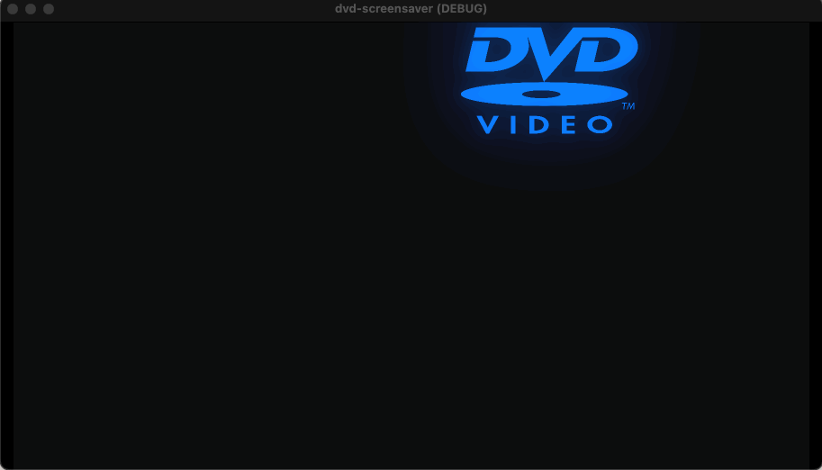

# Bouncing DVD Logo in Godot

## What is this?

To help me learn Godot, I recreated a typical DVD player's bouncing logo screensaver from scratch. Every time you run it, the order of the colors and the starting angle are randomized. There's probably a more "Godot-like"/concise way to write the logo node's code, but this works!

I intentionally didn't look up too many connected concepts (i.e. "how to make a bouncing logo in godot"), just isolated tasks where I got stuck or wasn't yet familiar with how to do something. I did this so that I could really get in and try implementing everything in my own way versus copying someone else's implementation of this idea.

### Screenshot

_GIF only plays once - refresh the page to replay._

